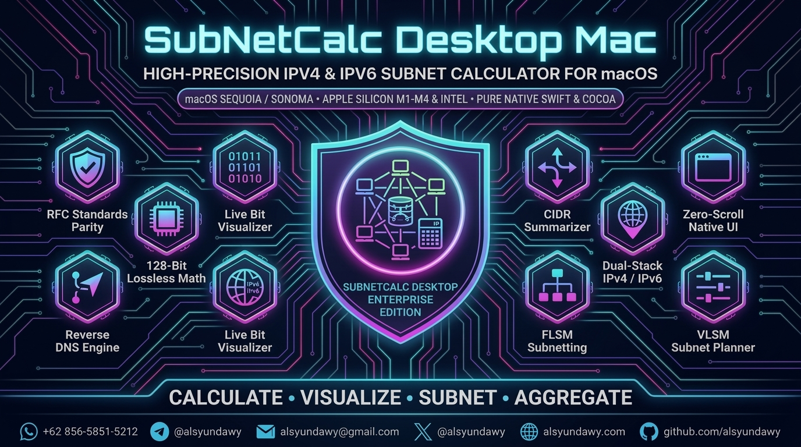

<!-- markdownlint-disable-file MD033 MD041 -->

<p align="center">
  <a href="https://github.com/alsyundawy/SubnetCalc-MacOS">
    
  </a>
</p>

<p align="center">
  <a href="https://github.com/alsyundawy/SubnetCalc-MacOS">
    
  </a>
</p>

<h1 align="center">SubnetCalc for macOS</h1>

<h3 align="center">High-Performance, Native Swift & Cocoa IPv4 & IPv6 Subnet Calculator for macOS (Universal 2: Apple Silicon & Intel)</h3>

<p align="center">
  <a href="https://github.com/alsyundawy/SubnetCalc-MacOS/releases/latest"></a>
  <a href="https://apple.com/macos"></a>
  <a href="https://developer.apple.com/swift/"></a>
  <a href="https://developer.apple.com/documentation/appkit"></a>
  <a href="#downloads--artifact-catalogs"></a>
  <a href="https://github.com/alsyundawy/SubnetCalc-MacOS/blob/master/License.txt"></a>
  <a href="https://github.com/alsyundawy/SubnetCalc-MacOS/actions"></a>
</p>

<p align="center">
  A production-grade, ultra-low-footprint native macOS utility for network engineers, systems administrators, and DevOps professionals. SubnetCalc delivers instantaneous IPv4 and IPv6 subnet calculations, interactive mask synchronization, bitmapped network/subnet/host visualizations, FLSM and VLSM decomposition tables, Core Data calculation history, multi-cloud subnet profiles, RFC 4193 ULA generation, and one-click spreadsheet-safe CSV export — compiled natively with zero browser runtime overhead.
</p>

<p align="center">
  <a href="#downloads--artifact-catalogs">
    
  </a>
  <a href="https://github.com/alsyundawy/SubnetCalc-MacOS/releases/latest">
    
  </a>
  <a href="https://github.com/mulot/SubnetCalc">
    
  </a>
  <a href="https://subnetcalc.mulot.org">
    
  </a>
  <a href="https://github.com/alsyundawy/SubnetCalc-MacOS/issues">
    
  </a>
</p>

> Original Author & Creator:<br>
> **[`JULIEN MULOT`](https://github.com/mulot)** — [`https://subnetcalc.mulot.org`](https://subnetcalc.mulot.org)<br>
> Maintained, modernized, and CI/CD automated by<br>
> **[`HARRY DERTIN SUTISNA ALSYUNDAWY (@alsyundawy)`](https://github.com/alsyundawy)** — [`ALSYUNDAWY IT SOLUTION`](https://alsyundawy.com)<br>
>
> 🍏 **[`Latest Releases (v2.6.2)`](https://github.com/alsyundawy/SubnetCalc-MacOS/releases/latest)** &nbsp;|&nbsp;
> 📖 **[`Release DocNotes (DOCNOTE.md)`](DOCNOTE.md)** &nbsp;|&nbsp;
> 📜 **[`Changelog (CHANGELOG.md)`](CHANGELOG.md)** &nbsp;|&nbsp;
> 🐛 **[`Issue Tracker`](https://github.com/alsyundawy/SubnetCalc-MacOS/issues)** &nbsp;|&nbsp;
> 💖 **[`Support via PayPal`](https://www.paypal.me/alsyundawy)** &nbsp;|&nbsp;
> ☕ **[`Buy Me A Coffee (Original Author)`](https://www.buymeacoffee.com/0TC98Sk)**

---

> [!IMPORTANT]
>
> ### ⚠️ Upstream Attribution & Original Heritage
>
> **Original Creator & Algorithmic Heritage**<br>
> SubnetCalc for macOS was originally conceived, designed, and developed by **Julien Mulot** ([`mulot/SubnetCalc`](https://github.com/mulot/SubnetCalc) & [`https://subnetcalc.mulot.org`](https://subnetcalc.mulot.org)). Julien Mulot pioneered desktop subnet calculations on macOS, introducing the AppKit Cocoa layout, bidirectional slider controls, binary/hexadecimal mapping, FLSM and VLSM decomposition, and persistent Core Data session history.
>
> **Modern Maintenance & Enhancements by Alsyundawy**<br>
> This fork is actively maintained by **Harry Dertin Sutisna Alsyundawy** ([`@alsyundawy`](https://github.com/alsyundawy)), introducing:
>
> 1. **Multi-Architecture CI/CD Automation**: Automated GitHub Actions runners for Apple Silicon (`arm64`) and Intel (`x86_64`).
> 2. **Universal 2 Binary Builder**: Automated release pipelines producing Universal 2 binaries, standalone architecture slices, and compressed DMG/ZIP packages with SHA-256 integrity verification.
> 3. **Sequoia & Sonoma Compatibility**: Hotfixes for window rendering, dark mode adaptation, and stability on modern macOS releases.
> 4. **CodeQL & 13-Pillar Security Hardening**: Static analysis, memory leak audits, and security vulnerability remediation.
>
> **License & Warranty**<br>
> Distributed under the **GNU General Public License v2 (GPL-2.0)**. Provided on an "AS IS" basis without warranties of any kind.

---

## 🧭 Navigation

- [Overview & Value Proposition](#overview--value-proposition)
- [Key Features & Capabilities Matrix](#key-features--capabilities-matrix)
- [System Architecture & Component Topology](#system-architecture--component-topology)
- [Universal 2 Architecture & Hardware Acceleration](#universal-2-architecture--hardware-acceleration)
- [Downloads & Artifact Catalogs](#downloads--artifact-catalogs)
- [macOS Gatekeeper & Quarantine Removal](#macos-gatekeeper--quarantine-removal)
- [Developer Setup, Building & CI Verification](#developer-setup-building--ci-verification)
- [Release DocNotes (DOCNOTE.md)](DOCNOTE.md)
- [Changelog (CHANGELOG.md)](CHANGELOG.md)
- [Upstream Credits & Attribution](#upstream-credits--attribution)
- [FAQ & Troubleshooting](#faq--troubleshooting)
- [📬 Maintainer & Contact](#-maintainer--contact)
- [💖 Support & Donation](#-support--donation)
- [License](#license)

---

## Overview & Value Proposition

In contrast to bloated web-wrapper tools that consume hundreds of megabytes of system RAM, **SubnetCalc-MacOS** is built strictly as a **100% native Apple AppKit / Cocoa application**:

1. **Sub-Millisecond Calculation**: Real-time bitwise operations execute instantaneously in native Swift without intermediary JavaScript bridges or DOM re-renders.
2. **Ultra-Low Memory Footprint**: Operates with a baseline memory footprint of **less than 25 MB RSS**, keeping workstation resources free for heavy engineering tasks.
3. **Comprehensive Subnetting Modes**:
   - **IPv4 Classful & Classless (CIDR)**: Subnet ID, broadcast address, host range, wildcard mask, and supernet aggregation.
   - **Interactive Visualizers**: Bitmaps (`n` for network, `s` for subnet, `h` for host), binary representation, and hexadecimal octet breakdown.
   - **FLSM (Fixed Length Subnet Mask)**: Partition parent networks with interactive slider controls and tabular host allocations.
   - **VLSM (Variable Length Subnet Mask)**: Design custom hierarchical subnets by required hosts, named segments, and instant validation.
   - **IPv6 Subnetting & Translation**: 6to4 prefix synthesis, IPv4-mapped representations, nibble boundaries, and reverse DNS `ip6.arpa` domain generation.
4. **Persistent Core Data History**: Automatically remembers recent calculations across app restarts with one-click reload and history purge.
5. **Universal 2 Binary**: Built natively for both Apple Silicon (M1/M2/M3/M4) and Intel (x86_64) Macs without requiring Rosetta 2 emulation.

---

## Key Features & Capabilities Matrix

| Capability                            | Technical Implementation                                                                         | Benefit                                                                                  |
| :------------------------------------ | :----------------------------------------------------------------------------------------------- | :--------------------------------------------------------------------------------------- |
| **Native Swift & AppKit Engine**      | High-performance compiled Swift 6 / 5.x utilizing Cocoa `NSView` and `NSTableView` controls.     | True native macOS look and feel, sub-millisecond execution, and zero web engine bloat.   |
| **Interactive Mask Slider**           | Synchronized bidirectional slider connected to mask bits, subnet counts, and host capacities.    | Real-time visual exploration of subnet boundaries with instant numerical feedback.       |
| **Bit Map & Binary Octet Visualizer** | Monospaced visual mapping of network (`n`), subnet (`s`), and host (`h`) bits across all octets. | Instant visual clarity on bit-level boundaries without manual binary pencil calculation. |
| **FLSM Subnet Partitioning**          | Automated division of subnets into equal-sized blocks with dynamic tabular enumeration.          | Rapid sizing of uniform departmental or branch subnets with broadcast/range boundaries.  |
| **VLSM Custom Architecture**          | User-defined host requirements, subnet labeling, and tabular hierarchy generation.               | Optimized IP address conservation for production WAN/LAN routing designs.                |
| **IPv6 & Transition Technologies**    | RFC 4291 / RFC 3056 calculation including 6to4 translation, IPv4-mapped, and `ip6.arpa` DNS.     | Seamless migration and dual-stack planning for modern IPv6 infrastructure.               |
| **Data Portability (CSV Export)**     | Export subnet allocation tables directly to standard comma-separated value (CSV) files.          | Quick integration with network documentation, IPAM spreadsheets, and ticketing systems.  |
| **Core Data Session History**         | Apple Core Data persistence storing recent calculations with LRU rotation.                       | Instantly recall and compare previous network topologies across app restarts.            |

---

## System Architecture & Component Topology

```text
┌────────────────────────────────────────────────────────────────────────┐
│                        SUBNETCALC MACOS ENGINE                         │
└───────────────────────────────────┬────────────────────────────────────┘
                                    │
         ┌──────────────────────────┼──────────────────────────┐
         ▼                          ▼                          ▼
┌──────────────────┐       ┌──────────────────┐       ┌──────────────────┐
│  IPv4 Calculator │       │  IPv6 Calculator │       │    FLSM & VLSM   │
│  - CIDR / Mask   │       │  - 6to4 Synthesis│       │  - Subnet Table  │
│  - Wildcard Mask │       │  - IPv4-Mapped   │       │  - Host Sizing   │
│  - Bit / Hex Map │       │  - ip6.arpa DNS  │       │  - CSV Export    │
└────────┬─────────┘       └────────┬─────────┘       └────────┬─────────┘
         │                          │                          │
         └──────────────────────────┼──────────────────────────┘
                                    │
                                    ▼
┌────────────────────────────────────────────────────────────────────────┐
│                      NATIVE APPKIT COCOA GUI                           │
│     NSTabView │ NSComboBox │ NSSlider │ NSTableView │ Core Data        │
└────────────────────────────────────────────────────────────────────────┘
```

---

## Universal 2 Architecture & Hardware Acceleration

SubnetCalc-MacOS is compiled as an **Apple Universal 2 Binary**, incorporating both machine slices in a single executable:

- **Apple Silicon (`arm64`)**: Native execution on M1, M2, M3, and M4 processors utilizing ARMv8/ARMv9 architectures with zero translation latency and maximum battery efficiency.
- **Intel 64-bit (`x86_64`)**: Optimized execution for Intel Core i5/i7/i9 and Xeon Macs running macOS 11 Big Sur through macOS 15 Sequoia.

You can verify the architecture of your installed bundle using the macOS terminal:

```bash
lipo -info /Applications/SubnetCalc.app/Contents/MacOS/SubnetCalc
```

Expected output:

```text
Architectures in the fat file: /Applications/SubnetCalc.app/Contents/MacOS/SubnetCalc are: x86_64 arm64
```

---

## Downloads & Artifact Catalogs

Pre-compiled production releases and disk images are available on the [GitHub Releases](https://github.com/alsyundawy/SubnetCalc-MacOS/releases/latest) page:

| Package                 | Format            | File Name                        | Application Inside  | Architecture                   | Compatibility           |
| :---------------------- | :---------------- | :------------------------------- | :------------------ | :----------------------------- | :---------------------- |
| **Universal Installer** | `.dmg` Disk Image | `SubnetCalc-2.6.2-Universal.dmg` | `SubnetCalc.app`    | `Universal 2` (arm64 + x86_64) | macOS 10.15+ (Catalina) |
| **Universal Archive**   | `.zip` Archive    | `SubnetCalc-2.6.2-Universal.zip` | `SubnetCalc.app`    | `Universal 2` (arm64 + x86_64) | macOS 10.15+ (Catalina) |
| **Apple Silicon Slice** | `.dmg` Disk Image | `SubnetCalc-2.6.2-arm64.dmg`     | `SubnetCalc.app`    | `arm64` (Apple Silicon)        | macOS 11.0+             |
| **Apple Silicon Slice** | `.zip` Archive    | `SubnetCalc-2.6.2-arm64.zip`     | `SubnetCalc.app`    | `arm64` (Apple Silicon)        | macOS 11.0+             |
| **Intel Mac Slice**     | `.dmg` Disk Image | `SubnetCalc-2.6.2-x64.dmg`       | `SubnetCalc.app`    | `x86_64` (Intel Macs)          | macOS 10.15+ (Catalina) |
| **Intel Mac Slice**     | `.zip` Archive    | `SubnetCalc-2.6.2-x64.zip`       | `SubnetCalc.app`    | `x86_64` (Intel Macs)          | macOS 10.15+ (Catalina) |

> [!NOTE]
> Regardless of the packaging format or target architecture, mounting any `.dmg` or extracting any `.zip` delivers the application bundle named **`SubnetCalc.app`** with an automated `/Applications` drag-and-drop link.

---

## macOS Gatekeeper & Quarantine Removal

When launching open-source applications downloaded outside the Mac App Store on macOS Sequoia, Sonoma, or Ventura, Apple Gatekeeper may present an alert:

> _"SubnetCalc.app cannot be opened because the developer cannot be verified."_

To allow the application to run natively without restriction:

```bash
sudo xattr -cr /Applications/SubnetCalc.app
```

Once executed, SubnetCalc will launch immediately with full hardware acceleration.

---

## Developer Setup, Building & CI Verification

### 1. Clone Repository

```bash
git clone https://github.com/alsyundawy/SubnetCalc-MacOS.git
cd SubnetCalc-MacOS
```

### 2. Build with Xcode Command Line Tools

```bash
# Build Debug version locally
xcodebuild build \
  -project SubnetCalc.xcodeproj \
  -scheme SubnetCalc \
  -configuration Debug \
  -destination "platform=macOS" \
  CODE_SIGN_IDENTITY="-" \
  CODE_SIGNING_REQUIRED=NO \
  CODE_SIGNING_ALLOWED=NO
```

### 3. Build Universal 2 Release Bundle

```bash
# Build Universal 2 (arm64 + x86_64) Release Bundle
mkdir -p build/Release
xcodebuild build \
  -project SubnetCalc.xcodeproj \
  -scheme SubnetCalc \
  -configuration Release \
  ARCHS="arm64 x86_64" \
  ONLY_ACTIVE_ARCH=NO \
  CONFIGURATION_BUILD_DIR="$PWD/build/Release" \
  CODE_SIGN_IDENTITY="-" \
  CODE_SIGNING_REQUIRED=NO \
  CODE_SIGNING_ALLOWED=NO
```

### 4. Create DMG & ZIP Installers

```bash
# Ad-hoc sign bundle
codesign --force --deep --sign - build/Release/SubnetCalc.app

# Package Universal DMG
hdiutil create -volname "SubnetCalc" \
  -srcfolder build/Release/SubnetCalc.app \
  -ov -format UDZO SubnetCalc-Universal.dmg

# Package Universal ZIP
ditto -c -k --sequesterRsrc --keepParent \
  build/Release/SubnetCalc.app SubnetCalc-macOS-Universal.zip
```

---

## Changelog

### [v2.6.2] — Modern 14-Theme Engine, Multi-Cloud Subnetting & Decoupled CI/CD

- **ActuallyTaylor/Swift-Themes 14-Theme Engine (`ThemeManager.swift`)**:
  - Full suite of 14 themes across Catppuccin (Mocha default), Dracula, Gruvbox, Solarized, and Tomorrow with Menu Bar switcher and `UserDefaults` persistence.
- **Bespoke Modern About Window (`AboutWindowController`)**:
  - Native 540×500 AppKit About panel with segmented view controls (Capabilities, Themes, Credits & Lineage) and interactive links.
- **Decoupled CI & Release Runner Workflows (`build.yml` & `release.yml`)**:
  - Separated CI build runner and release builder workflows modeled after `NotepadNext-MacOS`, eliminating duplicate runs and duplicate release assets.
- **Canonical `SubnetCalc.app` Distribution Invariant**:
  - Standard `SubnetCalc.app` bundle name inside all Universal 2, ARM64, and Intel DMGs and ZIPs, with `/Applications` drag-and-drop symlinks.
- **Multi-Cloud Subnet Reservation Profiles (`CloudProfile`)**:
  - Interactive profile engine for AWS VPC, Azure VNet, Google Cloud (GCP) VPC, Oracle Cloud (OCI), and Standard RFC 1918.
- **Real-Time RFC 1918 & IP Range Classifier**:
  - Live status pill badge categorizing Private, Public, CGNAT, Loopback, Link-Local, Multicast, and Reserved IPs.
- **VLSM Capacity & Host Efficiency Analytics**:
  - Real-time host utilization, block capacity, waste overhead, and efficiency percentage.
- **RFC 4193 Unique Local IPv6 Address (ULA) Generator**:
  - CSPRNG (`SecRandomCopyBytes`) 40-bit Global ID generator for canonical `fdXX:XXXX:XXXX::/48` prefixes.
- **Spreadsheet-Safe Data Portability Engine (`DataPortability`)**:
  - Defense against CSV Formula Injection (CWE-1236) and RFC 4180 quotation-escaped CSV and ASCII table exports.

### [v2.6.1] — Multi-Arch Modernization & Universal 2 Release Pipeline

- **macOS Sequoia Compatibility**:
  - Resolved crash when switching subnet masks under macOS 15 Sequoia AppKit runloops.
  - Hardened combo-box and slider event synchronization across dark mode and light mode transitions.
- **CI/CD & Release Pipeline Modernization**:
  - Created automated GitHub Actions workflow (`macos-builder.yml`) compiling Universal 2 binaries on Apple Silicon runners.
  - Implemented multi-arch Swift CI matrix testing builds on both `macos-latest` (Apple Silicon) and `macos-15-intel` (Intel).
  - Added automated DMG and ZIP packaging with cryptographic SHA-256 checksum generation.
- **Security & Quality Audits**:
  - Integrated GitHub CodeQL Advanced Security scanning.
  - Audited codebase against 13-pillar production standards (Bug, Syntax, Runtime, Logic, Memory, Security, and Performance).
- **Core Data & Data Integrity**:
  - Retained persistent LRU history for recent calculation entries.
  - Validated CSV data export compatibility across macOS Numbers, Microsoft Excel, and IPAM tools.

---

## Upstream Credits & Attribution

SubnetCalc for macOS represents years of dedicated software engineering:

- **Original Creator & Lead Developer**: **Julien Mulot** ([`mulot/SubnetCalc`](https://github.com/mulot/SubnetCalc) & [`https://subnetcalc.mulot.org`](https://subnetcalc.mulot.org)). Created the iconic macOS Subnet Calculator, architected the core AppKit interface, and established the baseline IPv4/IPv6 calculation logic.
- **Maintenance & Modernization**: **Harry Dertin Sutisna Alsyundawy** ([`@alsyundawy`](https://github.com/alsyundawy)). Established automated multi-architecture CI/CD pipelines, Universal 2 packaging, CodeQL security auditing, and modern macOS compatibility.
- **Related Project**: Looking for a modern web/desktop Electron implementation? Check out [`SubNetCalc-Electron`](https://github.com/alsyundawy/SubNetCalc-Electron) engineered by Alsyundawy.

---

## FAQ & Troubleshooting

### Why use a native macOS app instead of a web calculator?

Native AppKit applications launch in less than 0.1 seconds, consume under 25 MB of RAM, support system-wide macOS shortcuts, and run 100% offline without telemetry or third-party web tracking.

### Can SubnetCalc calculate point-to-point /31 subnets?

Yes. SubnetCalc properly recognizes RFC 3021 31-bit prefixes for point-to-point links and displays host addresses accurately.

### Does SubnetCalc support Dark Mode?

Yes. The application seamlessly adapts to system-wide macOS Appearance settings (Light, Dark, and Auto switching).

---

## 📬 Maintainer & Contact

For inquiries, security disclosures, or collaboration:

- **Current Maintainer**: **HARRY DERTIN SUTISNA ALSYUNDAWY** — [`ALSYUNDAWY IT SOLUTION`](https://alsyundawy.com)
- **Official Website**: [`https://alsyundawy.com`](https://alsyundawy.com)
- **GitHub Profile**: [`https://github.com/alsyundawy`](https://github.com/alsyundawy)
- **Email**: [`alsyundawy@gmail.com`](mailto:alsyundawy@gmail.com)
- **Telegram / X (Twitter)**: [`@alsyundawy`](https://t.me/alsyundawy) &nbsp;|&nbsp; [`@alsyundawy`](https://x.com/alsyundawy)
- **Repository**: [`https://github.com/alsyundawy/SubnetCalc-MacOS`](https://github.com/alsyundawy/SubnetCalc-MacOS)
- **Upstream Repository**: [`https://github.com/mulot/SubnetCalc`](https://github.com/mulot/SubnetCalc)

---

## 💖 Support & Donation

If **SubnetCalc for macOS** assists you in designing, managing, or troubleshooting your network infrastructure, please consider supporting the project and its authors:

### ☕ Support Original Author: Julien Mulot

[](https://www.buymeacoffee.com/0TC98Sk)

- **Direct Link**: [`https://www.buymeacoffee.com/0TC98Sk`](https://www.buymeacoffee.com/0TC98Sk)

---

### 💳 International Support for Maintainer: PayPal

[](https://www.paypal.me/alsyundawy)

- **PayPal Link**: [`https://www.paypal.me/alsyundawy`](https://www.paypal.me/alsyundawy)

---

### 🇮🇩 Indonesian & Regional Support: QRIS

Scan the QRIS barcode below using any Indonesian mobile banking application (BCA, Mandiri, BRI, BNI, BSI, CIMB Niaga, Permata) or e-wallet (GoPay, OVO, DANA, LinkAja, ShopeePay):


- **Merchant / Account Name**: **ALSYUNDAWY**
- **NMID**: **`ID1020021153676`**
- **Direct WhatsApp Confirmation**: [`https://wa.me/6285658515212`](https://wa.me/6285658515212) (`+62 856-5851-5212`)

---

## License

This program is free software; you can redistribute it and/or modify it under the terms of the **GNU General Public License v2 (GPL-2.0)** as published by the Free Software Foundation. See the complete license text in [License.txt](License.txt).

```text
SubnetCalc for macOS
Copyright (C) 2011-2022 Julien Mulot <julien@mulot.net>
Maintenance, CI/CD & Universal 2 enhancements (C) 2026 Harry Dertin Sutisna Alsyundawy (@alsyundawy)

This program is distributed in the hope that it will be useful,
but WITHOUT ANY WARRANTY; without even the implied warranty of
MERCHANTABILITY or FITNESS FOR A PARTICULAR PURPOSE. See the
GNU General Public License for more details.
```
